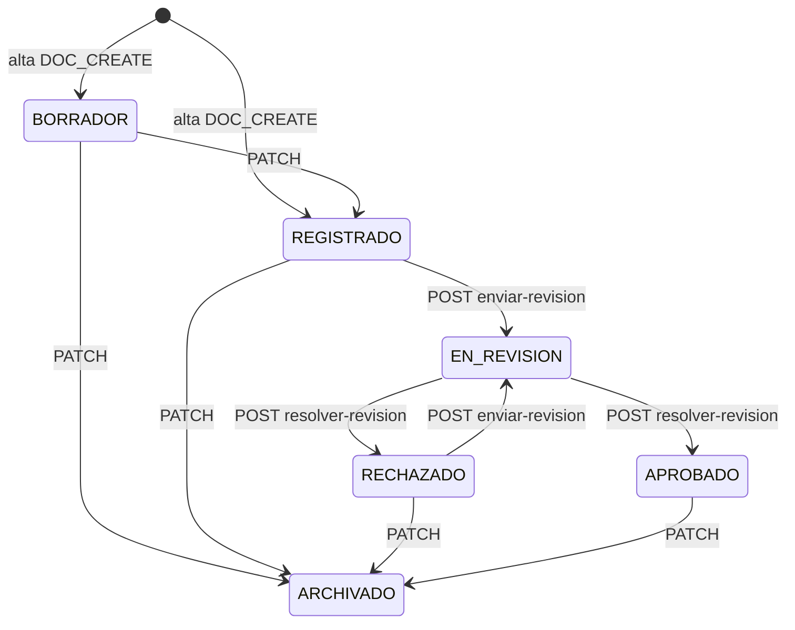

# Matriz — Workflow / estados documentales

**Proyecto:** SGD-GADPR-LM (`Tesisproyec`)  
**Checkpoint base:** `08a530f` (tipos documentales) + hardening workflow en esta fase.  
**Estándares:** ISO 15489 (integridad/trazabilidad), ISO/IEC 27001, OWASP ASVS V4/V5.

## Objetivo

Documentar el ciclo de vida **real**, endpoints, permisos, mutabilidad por estado,
bypass de PATCH, concurrencia de resolución y riesgos residuales (p. ej. integridad
post-aprobación) **sin** imponer una política nueva de inmutabilidad total.

## Estados reales

| Estado | Uso | Terminal | Editable metadatos (ADMIN+DOC_UPDATE) |
|---|---|---:|---:|
| `BORRADOR` | Borrador de captura | No | Sí |
| `REGISTRADO` | Formalizado | No | Sí |
| `EN_REVISION` | En cola de revisión | No | Sí (deuda/riesgo; ver residual) |
| `APROBADO` | Decisión favorable | No | Sí (deuda ALTA post-aprobación) |
| `RECHAZADO` | Decisión desfavorable | No | Sí |
| `ARCHIVADO` | Cierre / conservación | **Sí** | Solo `activo` |

Campo Prisma: `documentos.estado` (`String`, default `REGISTRADO`). Sin enum DB.

## Modelo

| Campo | Notas |
|---|---|
| `estado` | Catálogo en `documento-estado.util.ts` |
| `activo` | Soft-flag distinto de ARCHIVADO; baja lógica del registro |
| `fechaIngresoRevision` / `fechaLimiteSla` | SLA al enviar a revisión; se limpian al resolver |

## Transiciones

| Desde | Hacia | Permitido | Endpoint | Permiso |
|---|---|---:|---|---|
| — | BORRADOR / REGISTRADO | Sí | POST `/documentos` | `DOC_CREATE` |
| BORRADOR | REGISTRADO | Sí | PATCH `/documentos/:id` | ADMIN + `DOC_UPDATE` |
| BORRADOR / REGISTRADO / RECHAZADO / APROBADO | ARCHIVADO | Sí | PATCH | ADMIN + `DOC_UPDATE` |
| REGISTRADO / RECHAZADO | EN_REVISION | Sí | POST `.../enviar-revision` | `DOC_REVISION_SEND` + (creador\|ADMIN) |
| EN_REVISION | APROBADO / RECHAZADO | Sí | POST `.../resolver-revision` | ADMIN\|REVISOR + `DOC_REVISION_RESOLVE` |
| ARCHIVADO | * | No | — | — |

**Prohibido vía PATCH:** destinos `EN_REVISION`, `APROBADO`, `RECHAZADO`.

## Endpoints

| Método | Endpoint | Acción | Rol | Permiso | Cambia estado |
|---|---|---|---|---|---|
| PATCH | `/documentos/:id` | Metadatos / archivar / BORRADOR→REGISTRADO | ADMIN | `DOC_UPDATE` | Solo transiciones no-workflow |
| POST | `/documentos/:id/enviar-revision` | Enviar / reenviar | JWT | `DOC_REVISION_SEND` | → EN_REVISION |
| POST | `/documentos/:id/resolver-revision` | Aprobar / rechazar | ADMIN\|REVISOR | `DOC_REVISION_RESOLVE` | → APROBADO\|RECHAZADO |

Sin endpoint dedicado `archivar` / `reabrir`.

## Roles

| Rol | Editar (PATCH) | Enviar revisión | Aprobar | Rechazar | Archivar (PATCH) |
|---|---:|---:|---:|---:|---:|
| SUPERADMIN | Sí* | Sí† | Sí‡ | Sí‡ | Sí* |
| ADMIN | Sí* | Sí† | Sí‡ | Sí‡ | Sí* |
| USUARIO / EDITOR_DOC | No | Sí si creador† | No | No | No |
| REVISOR | No | No§ | Sí‡ | Sí‡ | No |
| AUDITOR / CONSULTA | No | No | No | No | No |

\* + `DOC_UPDATE`. † + `DOC_REVISION_SEND` y (creador\|admin). ‡ + `DOC_REVISION_RESOLVE`.  
§ Salvo también sea creador con permiso send.

## Permisos

| Acción | Permiso real |
|---|---|
| Editar metadata | `DOC_UPDATE` (+ rol ADMIN) |
| Enviar / reenviar revisión | `DOC_REVISION_SEND` |
| Aprobar / rechazar | `DOC_REVISION_RESOLVE` (+ ADMIN\|REVISOR) |
| Archivar | `DOC_UPDATE` (+ ADMIN) vía PATCH estado |
| Reabrir | No existe |

## DOC_UPDATE vs revisión

`DOC_UPDATE` **≠** enviar **≠** resolver.  
PATCH **no** puede simular envío ni resolución.

## Matriz de mutabilidad (ADMIN + DOC_UPDATE vía PATCH)

| Campo/acción | BORRADOR | REGISTRADO | EN_REVISION | APROBADO | RECHAZADO | ARCHIVADO |
|---|---:|---:|---:|---:|---:|---:|
| asunto / descripción | ✅ | ✅ | ⚠️ | ⚠️ | ✅ | ❌ |
| tipoDocumentalId | ✅ | ✅ | ⚠️ | ⚠️ | ✅ | ❌ |
| dependenciaId | ✅ | ✅ | ⚠️ | ⚠️ | ✅ | ❌ |
| contraparte / beneficiario | ✅ | ✅ | ⚠️ | ⚠️ | ✅ | ❌ |
| fechas | ✅ | ✅ | ⚠️ | ⚠️ | ✅ | ❌ |
| confidencialidad | ✅ | ✅ | ⚠️ | ⚠️ | ✅ | ❌ |
| estado → EN_REVISION | ❌ | ❌ formal | N/A | ❌ | ❌ formal | ❌ |
| estado → APROBADO/RECHAZADO | ❌ | ❌ | ❌ formal | ❌ | ❌ | ❌ |
| estado → ARCHIVADO | ✅ | ✅ | ❌ | ✅ | ✅ | N/A |
| activo | ✅ | ✅ | ✅ | ✅ | ✅ | ✅ |
| Subir archivo | ✅ | ✅ | ⚠️ | ⚠️ | ✅ | ❌ |
| Eliminar archivo | ✅* | ✅* | ⚠️* | ⚠️* | ✅* | ❌ |

\* Delete requiere ADMIN + `DOC_FILES_DELETE`.  
⚠️ = permitido hoy; riesgo de integridad (deuda funcional, no corregido sin decisión de producto).

## Envío a revisión

- Orígenes: `REGISTRADO`, `RECHAZADO` (reenvío).
- Actor: creador o ADMIN + `DOC_REVISION_SEND` + documento visible.
- Efectos: estado EN_REVISION, SLA, `DOC_STATE_CHANGED` + `DOC_SUBMITTED_FOR_REVIEW`.
- Concurrencia: `updateMany` con `WHERE estado = origen`.

## Aprobación / Rechazo

- Origen obligatorio: `EN_REVISION`.
- Rechazo: `motivo` trim, mín. 3, máx. 2000 (DTO).
- Motivo en auditoría `DOC_REVIEW_RESOLVED.meta.motivoRechazo` (no campo mutable en PATCH).
- Actor: JWT (ADMIN\|REVISOR).
- Timestamp: servidor.
- Doble resolución: segunda → `409 Conflict`.

## Archivado

- Vía PATCH a `ARCHIVADO`.
- Metadatos bloqueados; solo `activo` editable.
- Archivos: no upload/delete.

## Reapertura

No existe operación formal.

## Archivos

| Estado | Subir | Eliminar | Descargar |
|---|---:|---:|---:|
| BORRADOR / REGISTRADO / RECHAZADO | Sí† | Sí* | Sí† |
| EN_REVISION / APROBADO | Sí† (⚠️) | Sí* (⚠️) | Sí† |
| ARCHIVADO | No | No | Sí† |

Hash/versión: `DocumentoArchivo` versiona por nombre; soft-delete `activo`. Sin “congelar” evidencia post-aprobación.

## Tipo documental / Dependencia

Hardening previo (tipos/cargos/deps) se mantiene.  
Cambio de tipo/dependencia en APROBADO/EN_REVISION sigue permitido por DOC_UPDATE → residual ALTO.

## IDOR/BOLA

Visibilidad (`documentoVisibilityWhere`) antes de enviar/resolver. Documento ajeno → 404. Sin permiso → 403.

## Mass assignment

`UpdateDocumentoDto` whitelist + `forbidNonWhitelisted`.  
No acepta `createdById`, `aprobadoPorId`, `motivoRechazo`, etc.  
`estado` sí está en DTO pero acotado por máquina + anti-bypass.

## Concurrencia

Resolución/envío: `updateMany` condicionado al estado origen.  
Riesgo residual: edición de metadatos concurrente sin optimistic lock de `updatedAt`.

## Auditoría

| Transición | Actions |
|---|---|
| Cualquier cambio estado | `DOC_STATE_CHANGED` |
| Enviar/reenviar | + `DOC_SUBMITTED_FOR_REVIEW` |
| Aprobar/rechazar | + `DOC_REVIEW_RESOLVED` |
| `activo=false` | `DOC_DEACTIVATED` |
| Archivos | `DOC_FILE_*` |

## Frontend

| Botón | Condición |
|---|---|
| Editar | ADMIN |
| Enviar / Reenviar a revisión | REGISTRADO\|RECHAZADO + (creador\|admin) + `DOC_REVISION_SEND` |
| Aprobar / Rechazar | EN_REVISION + (ADMIN\|REVISOR) + `DOC_REVISION_RESOLVE` |
| Select estado (edición) | Oculta EN_REVISION/APROBADO/RECHAZADO como destinos nuevos |

## Riesgos residuales

| Riesgo | Severidad | Nota |
|---|---|---|
| Metadatos/archivos editables en APROBADO / EN_REVISION | **ALTO** | Preexistente; requiere decisión funcional (inmutabilidad / versión / reapertura) |
| Sin action `DOC_ARCHIVED` dedicada | MEDIO | Solo `DOC_STATE_CHANGED` |
| Race en PATCH metadatos | BAJO/MEDIO | Sin `updatedAt` check |
| `activo` vs ARCHIVADO | BAJO | Conceptos distintos; documentado |

## QA

1. PATCH `estado: EN_REVISION` → 400.  
2. PATCH `estado: APROBADO` → 400.  
3. POST enviar desde RECHAZADO → 200 + SLA.  
4. Doble resolver → 409.  
5. Motivo whitespace → 400.  
6. UI: reenviar en RECHAZADO; no EN_REVISION en select de edición.

## Decisión de producto pendiente

**No** se implementó inmutabilidad post-aprobación.  
Separar:

- **Bug de seguridad (corregido):** bypass PATCH de workflow formal + race de resolución.  
- **Deuda de workflow (pendiente):** qué campos críticos deben congelarse tras APROBADO / durante EN_REVISION.
